# SDL3_mixer 迁移说明 (SDL2_mixer API → SDL3_mixer 3.2.0)

## 背景

SDL3_mixer 3.2.0 正式版对 API 进行了彻底重构，废弃了旧的 **Channel/Music 二元模型**，改为统一的 **Track-based 架构**。本项目采用最小迁移方案完成适配。

> 官方迁移指南：https://wiki.libsdl.org/SDL3_mixer/README-migration

## 架构变化概览

### 旧架构 vs 新架构

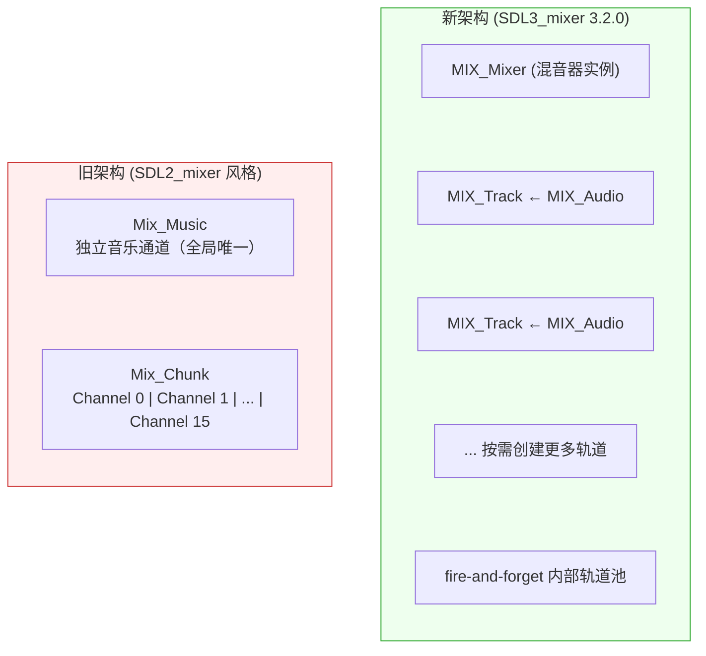

**核心变化：**
- `Mix_Chunk` + `Mix_Music` → 统一为 `MIX_Audio`（不再区分音效和音乐）
- 索引式 Channel 分配 → 指针式 `MIX_Track` 管理
- 全局单例混音器 → 显式 `MIX_Mixer` 对象

### 类型映射关系

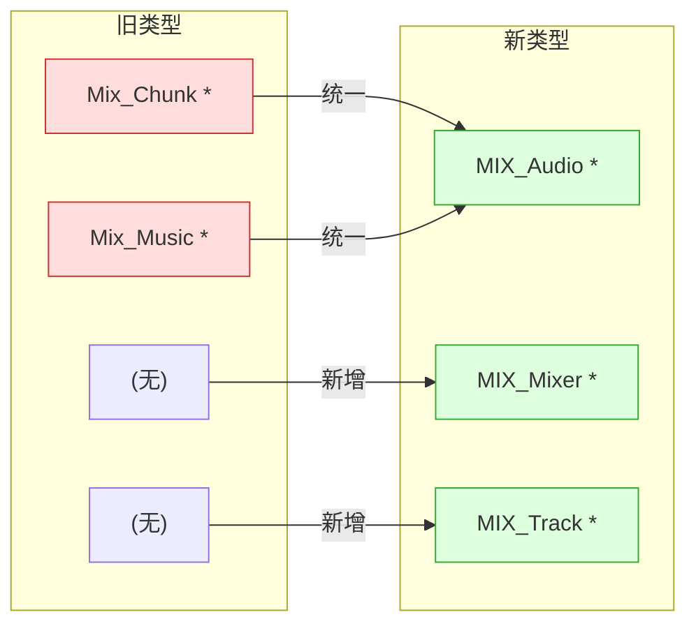

## 涉及文件

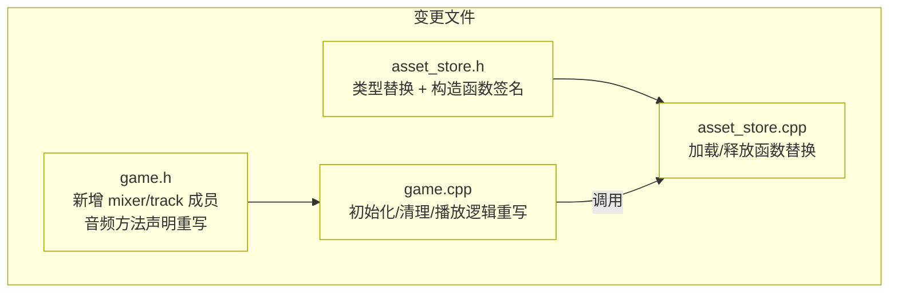

## 详细变更

### 1. 初始化流程 (`game.cpp` → `Game::init`)

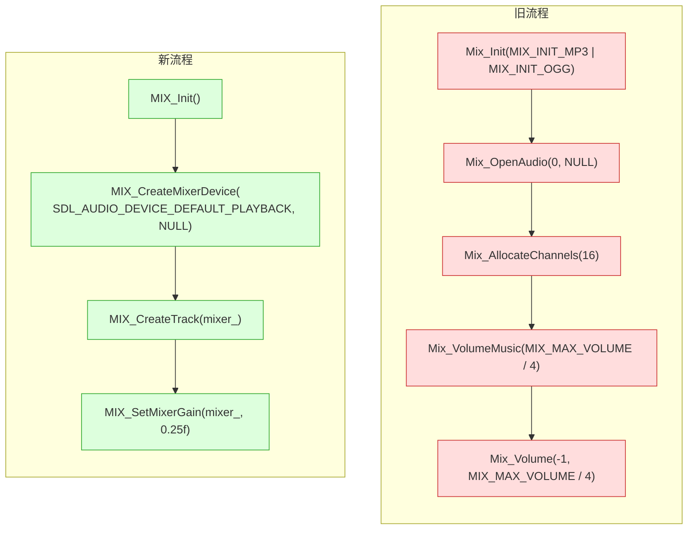

**要点：**
- `MIX_Init()` 无参数，内部自动检测可用解码器
- 不再需要 `Mix_AllocateChannels`，轨道按需创建
- 音量从 `int (0-128)` 改为 `float (0.0-1.0+)`，`MIX_MAX_VOLUME` 已移除

### 2. 音频加载 (`asset_store.cpp`)

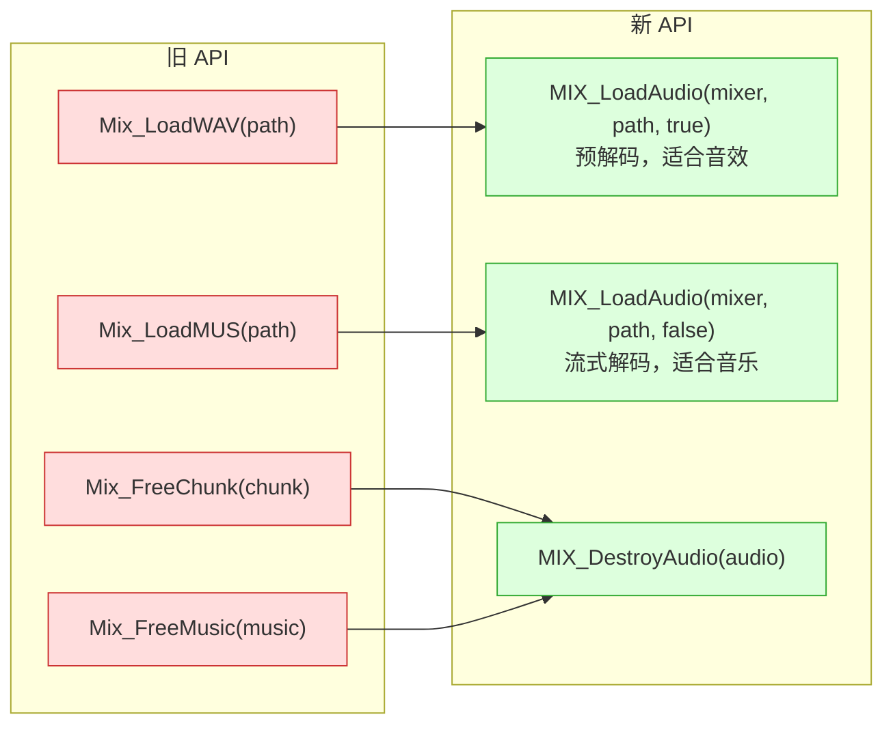

`AssetStore` 构造函数新增 `MIX_Mixer*` 参数，因为 `MIX_LoadAudio` 需要 mixer 上下文。

### 3. 音乐播放 (`game.cpp` → `Game::playMusic`)

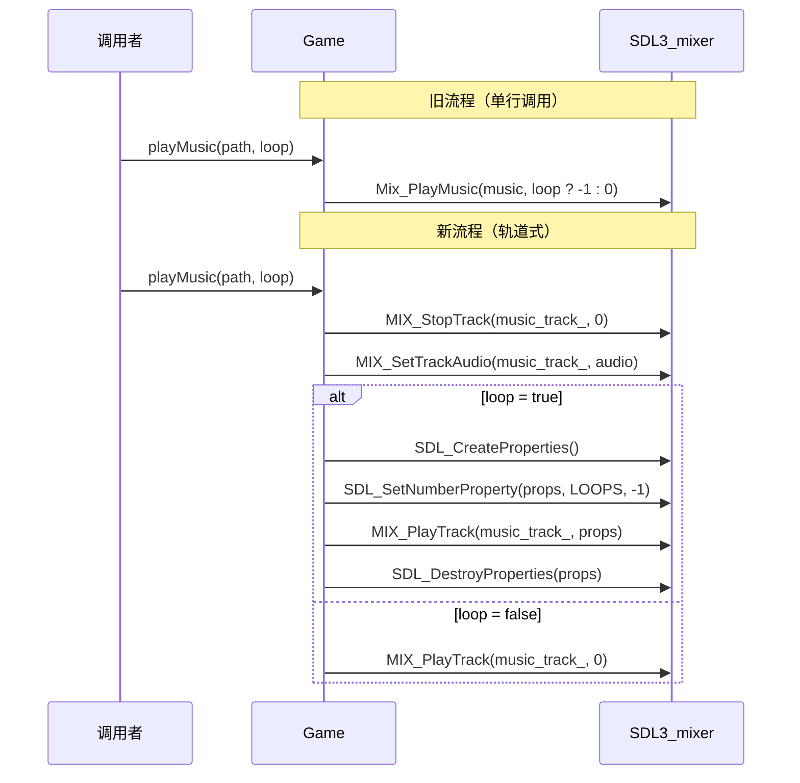

**要点：**
- 播放前需手动设置轨道的音频输入 (`MIX_SetTrackAudio`)
- 循环等参数通过 `SDL_Properties` 传递（`-1` = 无限循环）
- `MIX_PlayTrack` 第二个参数传 `0` 表示使用默认选项

### 4. 音效播放 (`game.h` → `Game::playSound`)

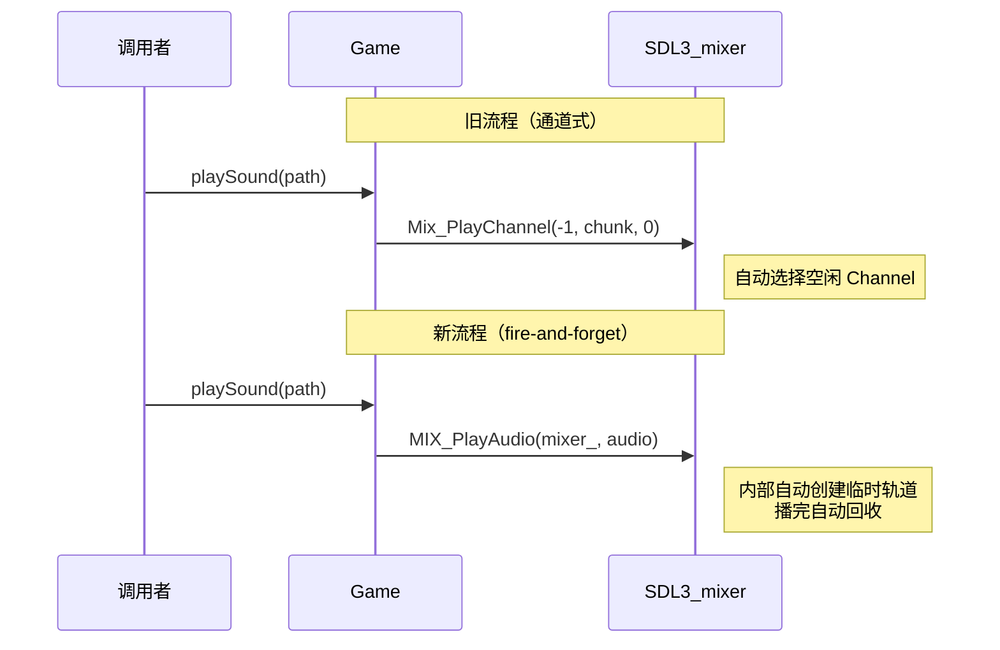

采用 **fire-and-forget** 模式：SDL_mixer 内部自动管理临时轨道，播放完毕自动回收。适合一次性音效（UI 点击、打击音等）。

### 5. 播放控制 (`game.h`)

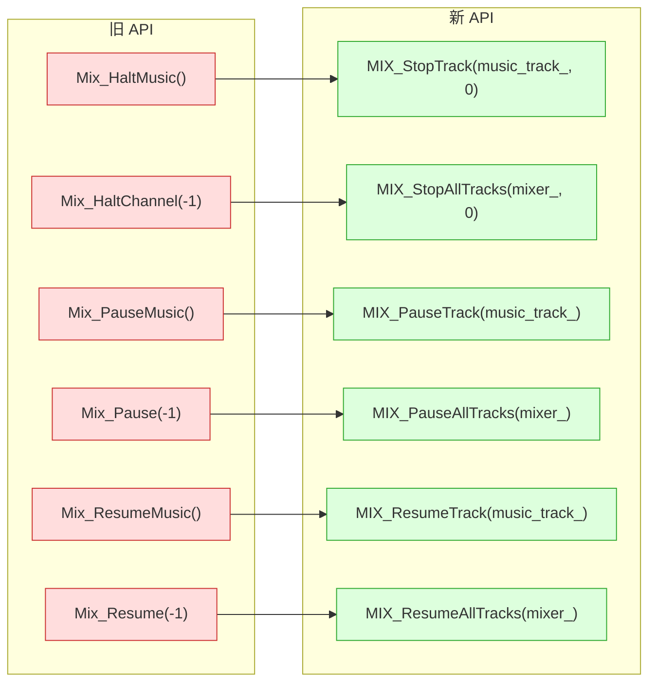

### 6. 清理流程 (`game.cpp` → `Game::clean`)

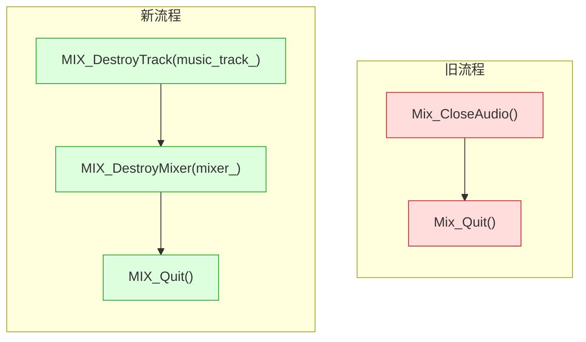

## 本项目完整音频生命周期

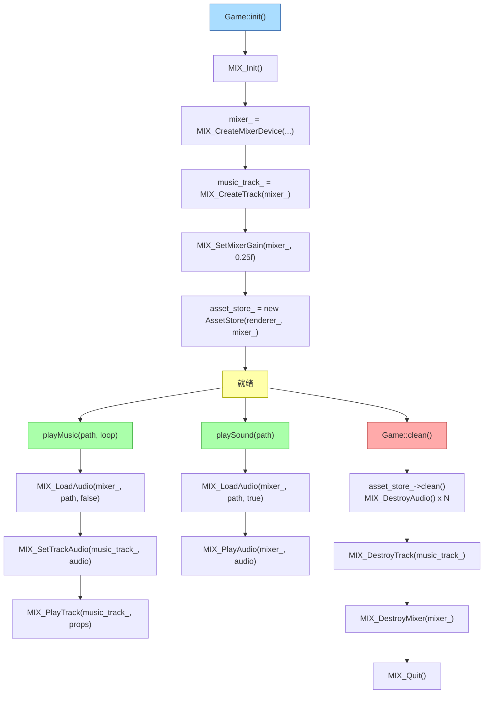

## 迁移策略

采用 **最小迁移方案**，保持代码逻辑和规模与迁移前一致：

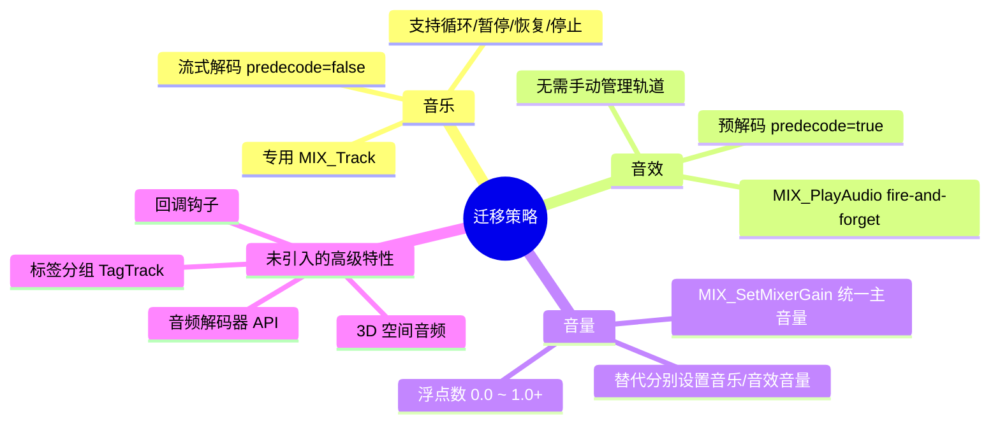
